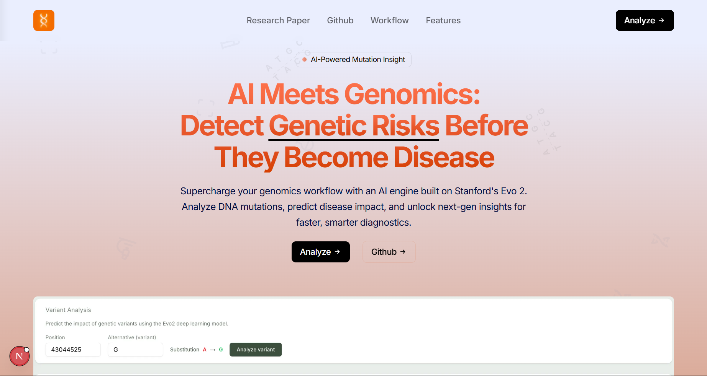
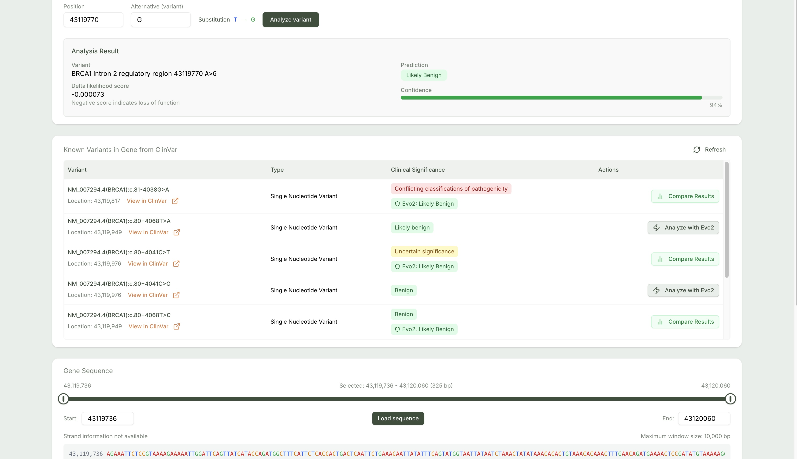

# GenomicsAI 🧬
> **AI-powered genetic variant analysis using cutting-edge genomic language models**






## 🔬 Project Overview

GenomicsAI is a **full-stack AI-powered web application** that empowers researchers, clinicians, and curious learners to **analyze the effects of genetic mutations** on human health. Leveraging the state-of-the-art **Evo 2 AI model**, users can predict whether single nucleotide variants (SNVs) are benign or pathogenic with unprecedented accuracy.

### What Can You Do?

- **🔍 Search for genes** (e.g., BRCA1 for breast cancer research)
- **🧬 Explore genome sequences** with interactive visualization
- **⚡ Input mutations** (e.g., G → A at position X) for instant analysis
- **🤖 AI-powered predictions** using the Evo 2 model for variant pathogenicity
- **📊 Compare predictions** against real-world data from ClinVar database
- **📈 Confidence scoring** to understand prediction reliability

This platform combines **cutting-edge AI**, **biomedical research**, and **modern web technologies** into a practical tool for genetic variant effect prediction.

## 🚀 Tech Stack

| Layer | Technologies Used |
|-------|------------------|
| 🧠 **AI Model** | **Evo 2** - State-of-the-art genomic language model from Stanford et al. |
| ⚙️ **Backend** | **Python**, **FastAPI**, serverless hosted on **Modal** with **H100 GPU** |
| 🌐 **Frontend** | **Next.js 15**, **React**, **TypeScript**, **Tailwind CSS**, **Shadcn UI** |
| 📡 **APIs** | **UCSC API** (genome sequences), **NCBI E-utilities**, **ClinVar** |

## 🎯 The Problem We're Solving

**Genetic mutations** can significantly impact human health, potentially increasing risks for diseases like cancer, cardiovascular disorders, and neurological conditions. However:

- ❓ It's challenging to determine **which mutations are harmful** versus benign
- 🔬 Many variants are classified as **"Variants of Unknown Significance" (VUS)** with unclear clinical impact
- ⏰ Traditional validation methods require **years of clinical studies**
- 💰 Experimental characterization is **expensive and time-consuming**

**💡 Our Solution:** We harness Evo 2's deep learning capabilities, trained on 100,000+ genomes, to provide instant, accurate predictions of mutation pathogenicity.

## 🏥 Real-World Use Cases

### 1. **Medical Diagnosis** 🩺
Clinicians can evaluate whether patient-specific mutations are likely disease-causing, enabling faster diagnostic decisions and personalized treatment plans.

### 2. **Research Acceleration** 🔬
Scientists can rapidly assess novel mutations without waiting for extensive clinical validation, accelerating genomics research and drug discovery.

### 3. **Genetic Counseling** 👨‍⚕️
Genetic counselors can provide evidence-based risk assessments for inherited diseases, helping families make informed healthcare decisions.

### 4. **Educational Tool** 📚
Students and educators can explore complex genetic concepts through interactive analysis, making genomics more accessible and engaging.

## 🧠 About Evo 2: The AI Behind the Magic

**Research Paper:** "Genome modeling and design across all domains of life with Evo 2"  
**Institutions:** Stanford University, UC Berkeley, UCSF, NVIDIA  
**Release Date:** February 2025  
**Access:** [ResearchGate PDF](https://www.biorxiv.org/content/10.1101/2025.02.18.638918v1.full.pdf)

### Key Highlights:

- **🌍 Massive Training Scale:** Trained on **9.3 trillion nucleotides** from over **128,000 species**
- **🧬 Multi-functional:** Predicts mutation impact, generates realistic DNA sequences, and enables genome design
- **🤖 Advanced Architecture:** Transformer-based model similar to GPT, but optimized for biological sequences
- **🎯 State-of-the-art Accuracy:** Achieves unprecedented precision in pathogenicity prediction
- **🔬 Research Impact:** Enables AI-driven bioinformatics for simulation, prediction, and genome design

This groundbreaking research opens new frontiers in **genomics**, **synthetic biology**, and **personalized medicine**.

## ✨ Feature Breakdown

| Feature | Description |
|---------|-------------|
| 🧬 **Mutation Analysis** | Input DNA mutations and receive AI-powered pathogenicity predictions |
| 🧠 **AI vs. Clinical Data** | Compare Evo 2 predictions with validated ClinVar database entries |
| 📊 **Confidence Estimation** | Understand prediction reliability with confidence scores |
| 🌍 **Genome Assembly Support** | Choose between genome versions (hg19, hg38, etc.) |
| 🔍 **Advanced Gene Search** | Search by gene name or browse by chromosomal location |
| 📋 **Reference Sequence Viewer** | Interactive display of complete gene sequences via UCSC API |
| 🧪 **Variant Database Integration** | Browse known mutations and their clinical significance |
| ⚡ **High-Performance Backend** | Real-time GPU-accelerated analysis via FastAPI and Modal |
| 🎨 **Modern UI/UX** | Responsive, intuitive interface built with Tailwind CSS and Shadcn UI |

## 🚀 Getting Started

### Prerequisites

- Node.js 18+ 
- Python 3.9+
- Modal account (for GPU backend)

### Installation

```bash
# Clone the repository
git clone https://github.com/sehajmakkar/GenomicsAI.git
cd genomicsai

# Install frontend dependencies
npm install

# Install backend dependencies
pip install -r requirements.txt

# Set up environment variables
cp .env.example .env
# Add your API keys and configuration
NEXT_PUBLIC_ANALYZE_SINGLE_VARIANT_BASE_URL = ""

# Start the development servers
npm run dev          # Frontend (Next.js)
modal run main.py   # Backend (Modal + FastAPI)
```


## 🤝 Contributing

We welcome contributions! Please see our [Contributing Guidelines](CONTRIBUTING.md) for details on:

- Code standards and formatting
- Testing requirements
- Pull request process
- Issue reporting

## 📜 License

This project is licensed under the MIT License - see the [LICENSE](LICENSE) file for details.

## 🙏 Acknowledgments

- **Stanford AI Lab** for the Evo 2 model and research
- **NCBI** for ClinVar and genomic databases
- **UCSC Genome Browser** for sequence data APIs
- **Modal Labs** for GPU infrastructure
- **Vercel** for frontend hosting

## 📬 Contact

- **Project Lead:** [Sehaj Preet](mailto:sehajmakkar007@gmail.com)
- **Issues:** [GitHub Issues](https://github.com/sehajmakkar/GenomicAI/issues)
- **Discussions:** [GitHub Discussions](https://github.com/sehajmakkar/GenomicAI/discussions)

---

**⭐ Star this repository if GenomicsAI helps advance your genomics research!**

*Built with ❤️ for the scientific community*